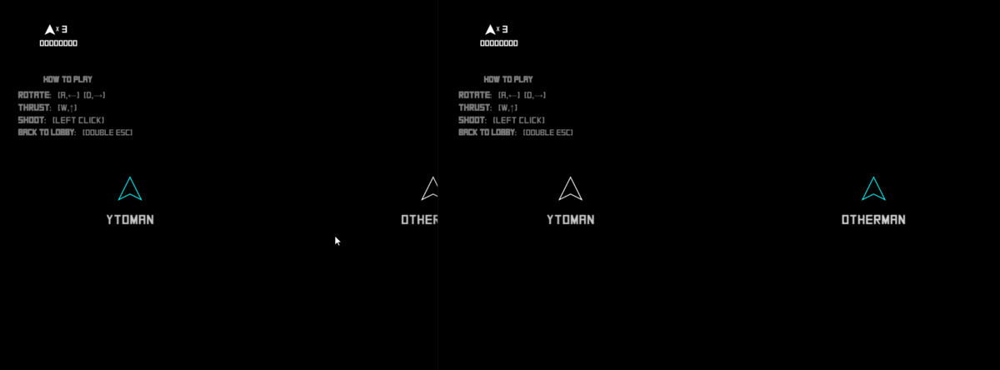
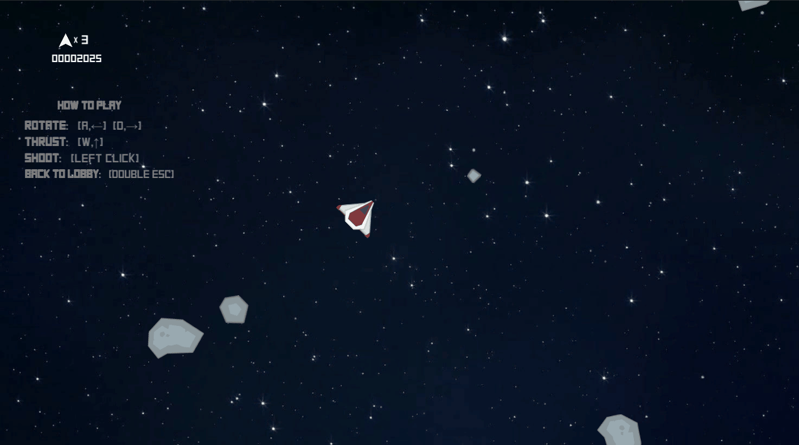
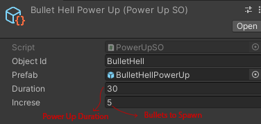
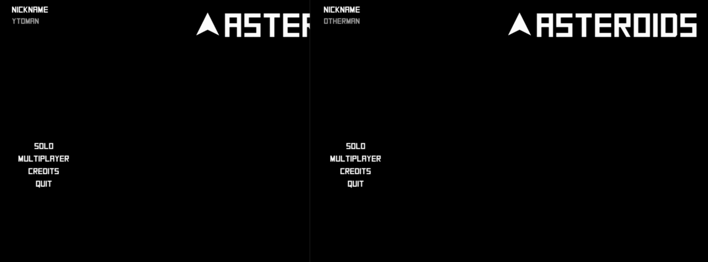

# Games.Asteroids.Multiplayer
It's the clasic game but u can play with other players!

## Unity version

2020.3.23F1

## New Image!
# Old

# New

## Documentation (coming soon)
https://claux.gitbook.io/asteroids-multiplayer/

## New Features

- Enemy Spawn (UFO)
- Power Ups (Immunty, Bullet Hell, Speed)
- New Arquitecture (MVC, Unity Scriptable objects, Custom)
- New Design Patterns (Strategy, State, Factory, Object Pool, Observer)
- SOLID Principles to generete new behaviour or new objects!

## Change the rules!

- U can changes some values to get more FUN!
- Go to Resources/Game/PowerUps => there u can change values to get more bullets or more time in any power UP!

## You can Join as Client or Host!

## Demo Playing

## Match

Try to win!! u need to get more Score than ur opponent;

## How To test

- Go to PLAYHERE folder
- Open Games.Asteroids.Client.exe
- Play...